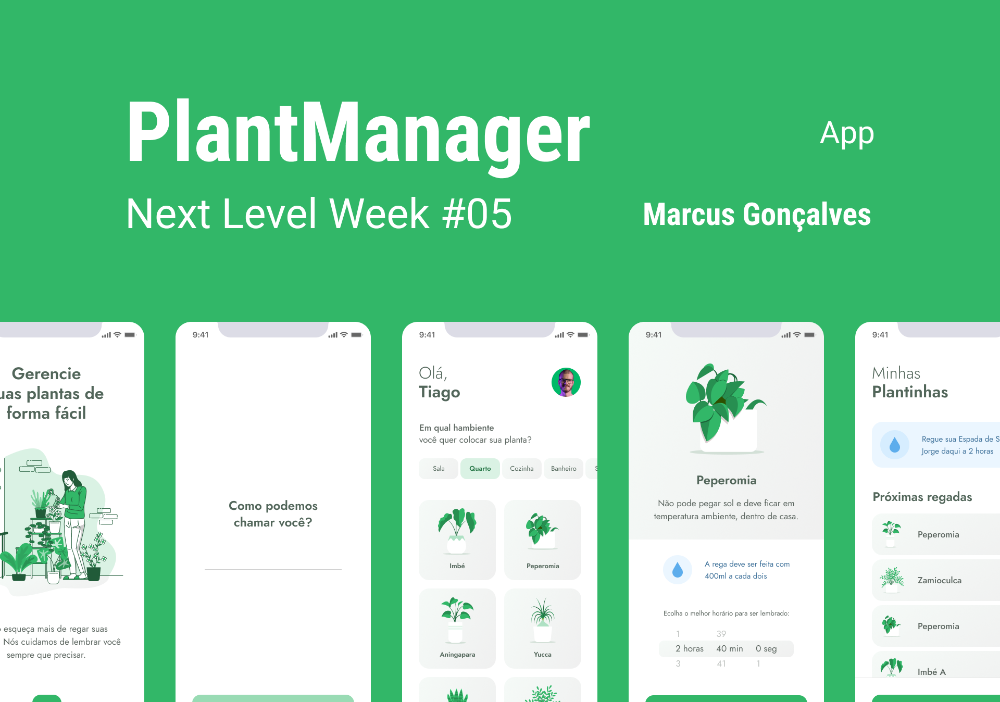

# Plant Manager
**Projeto desenvolvido por mim no evento da Next Level Week 5.0**

É um app que te ajuda a gerenciar suas plantas, mandando notificações na hora de regar, avisos de onde pode manter aquele tipo de planta e outras informações.
Estava buscando expandir meus conhecimentos em React Native, com certeza com esse projeto deu para ver bastante coisa nova!
